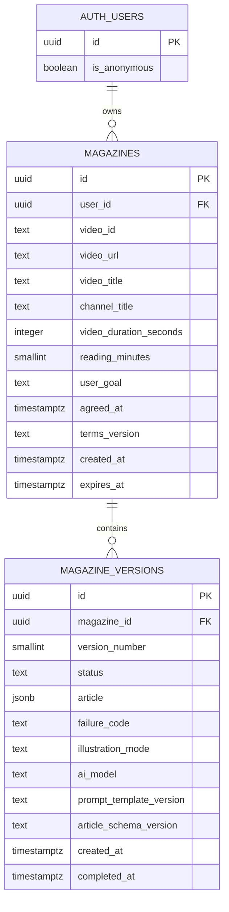
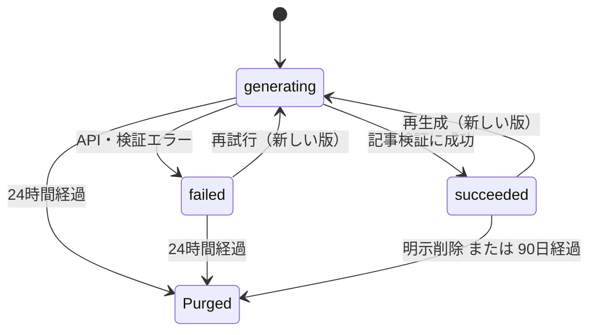

# Yomazine データ設計書（Supabase）

更新日：2026年9月10日  
対象：匿名サインインを使うPC向けWebアプリ

## 1. この設計の前提

この設計は、既存の要件定義書にある「DB・履歴なし」のMVP方針を、合意のうえで変更したものです。生成した雑誌の履歴は匿名ユーザーごとに90日間保存します。一方で、PDF、AI生成画像、動画・音声・字幕、生のGemini応答、独自の行動分析ログは保存しません。

- 利用者の識別には Supabase Auth の Anonymous Sign-ins を使う。
- すべての業務データは `auth.users.id` を `user_id` として持つ。
- データベースは RLS により、本人の行だけを読み書きできる。
- URLは動画IDから組み立てた正規化URLだけを保存し、貼り付け元の追跡パラメータは残さない。
- 明示削除は即時完全削除、成功履歴は生成開始から90日で完全削除する。
- 失敗・中断した生成版は24時間で完全削除する。

## 2. ER図



`magazines` は「同じ動画・知りたいこと・読書時間で作った1冊」を表します。再生成しても親は増やさず、`magazine_versions` に版を追加します。別の動画や別の目的で作る場合は、新しい `magazines` を作ります。

## 3. テーブル定義

### `public.magazines`

| 列 | 型 | 用途・制約 |
| --- | --- | --- |
| `id` | UUID | 雑誌ID。推測可能な連番や公開URLには使わない。 |
| `user_id` | UUID | `auth.users.id`。RLSの所有者判定に使う。 |
| `video_id` | TEXT | YouTube動画ID。通常動画をURL確認済みであることが前提。 |
| `video_url` | TEXT | `https://www.youtube.com/watch?v={video_id}` の正規化URL。 |
| `video_title` | TEXT | 生成時点の動画タイトルのスナップショット。 |
| `channel_title` | TEXT | 生成時点のチャンネル名のスナップショット。 |
| `video_duration_seconds` | INTEGER | 1〜3600秒。60分超の動画は登録前に除外する。 |
| `video_minutes` | SMALLINT（生成列） | PDF・プレビュー表示用に秒数を切り上げて分へ換算する。 |
| `reading_minutes` | SMALLINT | `3`、`5`、`10` のみ。 |
| `saved_minutes` | SMALLINT（生成列） | `max(0, video_minutes - reading_minutes)`。 |
| `user_goal` | TEXT | 必須、前後空白を除き最大200文字。 |
| `agreed_at` | TIMESTAMPTZ | 利用ルールへ同意した日時。 |
| `terms_version` | TEXT | アプリコードで管理する利用ルールの版（例：`v1.0`）。 |
| `created_at` / `expires_at` | TIMESTAMPTZ | 作成日時と90日後の完全削除期限。 |

動画サムネイル、元URL、動画フレーム、字幕、音声は列として持ちません。

### `public.magazine_versions`

| 列 | 型 | 用途・制約 |
| --- | --- | --- |
| `id` | UUID | 生成版ID。 |
| `magazine_id` | UUID | 親の雑誌。親を削除すると連鎖削除する。 |
| `version_number` | SMALLINT | 雑誌内で一意の1始まりの世代番号。 |
| `status` | TEXT | `generating`、`succeeded`、`failed` のいずれか。 |
| `article` | JSONB | 成功版だけに保存する、検証済みの構造化記事。 |
| `failure_code` | TEXT | 失敗時だけ保存する安全な固定値。生のAPIエラーは保存しない。 |
| `illustration_mode` | TEXT | `ephemeral_generated`、`fallback_layout`、`not_requested`。画像そのものは保存しない。 |
| `ai_model` | TEXT | 生成に使ったAIモデル名。 |
| `prompt_template_version` | TEXT | プロンプト本文ではなくテンプレートの版番号。 |
| `article_schema_version` | TEXT | JSONBの構造を判定するための版番号。 |
| `created_at` / `completed_at` | TIMESTAMPTZ | 生成開始・完了日時。 |

`article` は要件定義書の `MagazineArticle` に対応するJSONBです。サーバーは保存前にZod等で、必須項目・文字数・重要ポイント3件・実践ポイント・引用ルールを検証します。DBにも必須キーと配列型の最低限の制約を置きます。

```ts
type MagazineArticleV1 = {
  magazineTitle: string;
  lead: string;
  keyPoints: [string, string, string];
  memorableMoment: string;
  directQuote?: string;
  episode: string;
  discovery: string;
  practicalPoints: string[];
  closing: string;
};
```

## 4. 状態遷移と削除



- 成功版を持たない雑誌は、生成版の削除後に親ごと削除します。
- 成功版を持つ雑誌は、90日を超えた時点またはユーザーの削除操作で親ごと削除します。
- 外部API呼び出し中の画像やPDFのバイト列は、リクエスト処理のメモリまたはブラウザ内だけに存在させ、DB・Storageへ書き込みません。

## 5. 認可とアクセス経路

画面はNext.js Route Handlerを経由します。Route HandlerではユーザーのSupabaseセッションを引き継いだクライアントを使い、`service_role`キーをブラウザへ渡しません。

| 操作 | 許可対象 | DB側の保証 |
| --- | --- | --- |
| 履歴一覧・詳細取得 | 所有者 | `magazines.user_id = auth.uid()` |
| 雑誌・生成版の作成・更新 | 所有者 | 親雑誌の所有者一致を確認 |
| 個別削除・全件削除 | 所有者 | 所有者の行だけを削除 |
| 90日・24時間の期限削除 | 定期実行用のDB関数 | クライアントからの実行権限なし |

匿名ユーザーであってもSupabase上では `authenticated` ロールになるため、`anon` ロールへのテーブル権限は与えません。ブラウザの認証情報を失うと履歴は復旧できません。メール認証・共有URL・他端末同期は今回の対象外です。

## 6. インデックスと運用

- `magazines (user_id, created_at desc)`：所有者の履歴一覧とRLSの絞り込みに使用。
- `magazines (expires_at)`：90日削除の対象検索に使用。
- `magazine_versions (magazine_id, version_number desc)`：版一覧・最新成功版の取得に使用。
- `pg_cron` を有効化後、毎日00:15 JST（15:15 UTC）に削除関数を実行する。
- Cronの実行履歴にはDB関数呼び出しが記録されるため、アプリ側に別のアクセスログ表は作らない。

実装可能なSQLは [`supabase/migrations/202609100001_create_yomazine_schema.sql`](supabase/migrations/202609100001_create_yomazine_schema.sql) と [`supabase/migrations/202609100002_schedule_retention_cleanup.sql`](supabase/migrations/202609100002_schedule_retention_cleanup.sql) に置いています。
