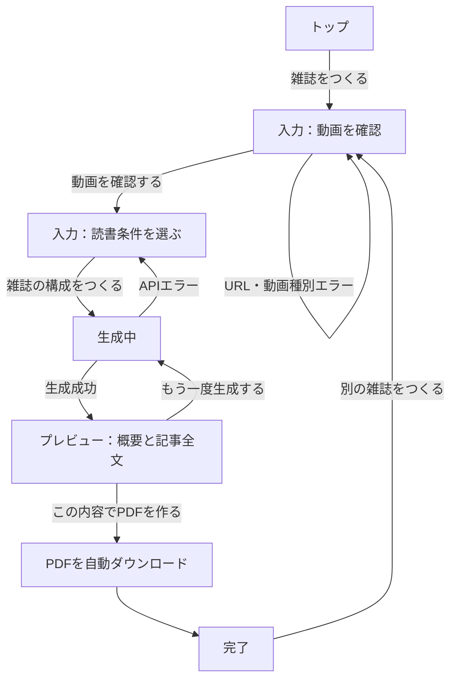

# Yomazine 画面設計書

更新日：2026年9月10日  
対象：PCブラウザ（横幅 1280px 以上を主な基準）

## 1. 設計コンセプト

- **価値：** 観る時間を、読む時間に。
- **トーン：** 落ち着いたエディトリアル調。白を基調に黄緑をアクセントにし、余白を十分に取る。
- **文字：** 見出し・雑誌タイトルは明朝系、操作・説明・本文はゴシック系。
- **レイアウト：** コンテンツは最大幅約 1,120px の中央カラムに収める。
- **共通要素：** 左上に小さな `Yomazine` ロゴ、右上にキャッチコピーを置く。

## 2. 画面遷移



## 3. 画面別設計

### 3.1 トップ

**目的：** 何を作れるサービスかを理解してもらい、入力へ進んでもらう。

```text
┌────────────────────────────────────────────────────────────┐
│ Yomazine                                  観る時間を、読む時間に。 │
│                                                            │
│  YOUTUBE TO READING        ┌──────────────────────┐       │
│  観る時間を、              │  架空の雑誌モック     │       │
│  読む時間に。              │  表紙 + 中面          │       │
│                             │  ※動画素材は使わない │       │
│  YouTube動画を、落ち着いて  └──────────────────────┘       │
│  読める小さな雑誌へ。                                       │
│                                                            │
│  [ 雑誌をつくる ]                                           │
│                                                            │
│  01 URLを入れる    02 読む目的を選ぶ    03 PDFで読む        │
└────────────────────────────────────────────────────────────┘
```

- 主CTAは `雑誌をつくる` のみ。
- 右側には、表紙と中面を少し重ねた架空の雑誌見本を置く。
- 下部に3ステップを短く示す。

### 3.2 入力

**目的：** 対象動画を確認してから、記事の視点と読書時間を指定する。

```text
┌────────────────────────────────────────────────────────────┐
│ Yomazine                                                    │
│  1. 動画を確認  ───  2. 読書条件を選ぶ  ───  3. 雑誌を生成 │
│                                                            │
│  読みたい動画を教えてください。                            │
│                                                            │
│  YouTube動画のURL                                           │
│  [ https://www.youtube.com/watch?v=...                    ] │
│  [ 動画を確認する ]                                         │
│                                                            │
│  ┌──────────────────────────────────────────────────────┐  │
│  │ サムネイル │ タイトル / チャンネル名 / 動画時間        │  │
│  └──────────────────────────────────────────────────────┘  │
│                                                            │
│  この動画で知りたいこと                                    │
│  [ 明日試せる習慣を知りたい                              ] │
│                                                            │
│  読書時間  [ 約3分 ] [ 約5分・選択中 ] [ 約10分 ]          │
│                                                            │
│  □ 個人利用・非再配布に同意する                            │
│    詳しい利用ルールを確認する                              │
│                                                            │
│  [ 雑誌の構成をつくる ]                                    │
└────────────────────────────────────────────────────────────┘
```

- URL確認は、貼り付け後にユーザーが `動画を確認する` を押して実行する。
- 確認できた動画は、サムネイル・タイトル・チャンネル名・再生時間を小さなカードに表示する。サムネイルはアプリ画面だけで使い、PDFには入れない。
- 読書時間は説明付きの選択カード。初期選択は実装時に決める。
- 同意前は生成ボタンを無効にする。
- URL不正、Shorts、ライブ、再生リスト、非公開、60分超は、該当欄の直下に理由を表示する。

### 3.3 生成中

**目的：** 待機中の不安を減らし、処理の進行と安全性を伝える。

```text
┌────────────────────────────────────────────────────────────┐
│ Yomazine                                                    │
│                                                            │
│                         ●                                  │
│                   雑誌を編集中です。                        │
│        少しだけお待ちください。動画は保存しません。          │
│                                                            │
│  ✓  動画を読んでいます                                      │
│  ●  記事を編集中                                            │
│  3  雑誌を組版中                                            │
│                                                            │
│              生成には数十秒かかることがあります。             │
└────────────────────────────────────────────────────────────┘
```

- 入力画面に重ねるモーダルではなく、専用の全画面として表示する。
- 3段階を縦に並べ、完了・進行中・待機中を同時に見せる。
- API失敗時は入力内容を保持した入力画面へ戻し、専門用語を避けたエラーを表示する。

### 3.4 プレビュー

**目的：** 内容全体を確認し、再生成またはPDF化を判断してもらう。

```text
┌────────────────────────────────────────────────────────────┐
│ Yomazine                                                    │
│                                                            │
│  ┌───────────────────┐  PREVIEW                             │
│  │ 表紙風ビジュアル   │  変化は、いつも小さな習慣から。       │
│  │                   │  リード文                            │
│  │ 雑誌タイトル       │  01 重要ポイント                     │
│  │                   │  02 重要ポイント                     │
│  └───────────────────┘  03 重要ポイント                     │
│                         ┌──────────────────────────────┐    │
│                         │ 動画 12分 → 読書 約5分         │    │
│                         │ 7分短縮できました              │    │
│                         └──────────────────────────────┘    │
│                                                            │
│  ───────────────── 記事全文プレビュー ───────────────────   │
│  大きく変わる前に、できることを小さくする。                  │
│  本文 / 印象的な場面または引用 / エピソード / 発見 / 結び    │
│                                                            │
│  [ もう一度生成する ]  [ この内容でPDFを作る ]               │
└────────────────────────────────────────────────────────────┘
```

- PC向けに、上部は表紙風ビジュアルとサマリーの2カラムにする。
- `動画○分 → 読書約○分` と、短縮できた場合の時間を目立つ数値カードとして置く。
- **記事全文を必ずプレビュー内で読めるようにする。** 要約だけでPDF作成を判断させない。
- 全文は、見出し・リード・印象的な場面（必要に応じて短い引用）・エピソード・発見・実践ポイント・結びの順で配置する。
- `もう一度生成する` はアウトラインの副ボタン、`この内容でPDFを作る` は黄緑の主ボタン。

### 3.5 完了・ダウンロード

**目的：** PDFを確実に手元へ渡し、オフライン読書へ促す。

```text
┌────────────────────────────────────────────────────────────┐
│ Yomazine                                                    │
│                                                            │
│                         ●                                  │
│                    雑誌ができました。                       │
│                                                            │
│        PDFのダウンロードを開始しました。                    │
│        PDFを開いたら、ブラウザを閉じて読書へ。               │
│                                                            │
│                    別の雑誌をつくる                         │
└────────────────────────────────────────────────────────────┘
```

- PDFは作成完了と同時に自動ダウンロードする。
- ダウンロードに失敗した場合だけ、再試行ボタンを表示する。
- `別の雑誌をつくる` は控えめなテキストリンクにする。

## 4. 例外時の画面ルール

| 状況 | 表示・操作 |
| --- | --- |
| URL不正・対象外動画 | URL欄の直下に理由を表示し、入力内容を維持する。 |
| 動画情報を取得できない | 「公開状態の動画を確認してください」と案内する。 |
| 記事生成・APIエラー | 入力画面へ戻し、入力値を維持して再試行できるようにする。生のエラーは出さない。 |
| 画像生成だけ失敗 | 図形・タイポグラフィ中心の代替レイアウトでPDF化を続けられるようにし、必要に応じて画像のみ再生成できるようにする。 |
| PDFダウンロード失敗 | 完了画面に再試行ボタンを表示する。 |

## 5. 実装に渡すコンポーネント案

```text
AppShell
├─ AppHeader
├─ LandingPage
│  ├─ Hero
│  ├─ MagazineMock
│  └─ HowItWorks
├─ CreateMagazinePage
│  ├─ StepIndicator
│  ├─ VideoUrlField
│  ├─ VideoInfoCard
│  ├─ ReadingTimeSelector
│  └─ TermsAgreement
├─ GeneratingPage
│  └─ GenerationProgress
├─ PreviewPage
│  ├─ MagazineCoverCard
│  ├─ ArticleSummary
│  ├─ TimeSavedCard
│  ├─ FullArticlePreview
│  └─ PreviewActions
└─ DownloadCompletePage
```

## 6. 実装時に確認すること

- 実際の生成記事が長い場合も、プレビューで省略せず全文を確認できること。
- PDF用の画像と、アプリ内の動画サムネイルを混同しないこと。
- すべての主操作にキーボードで到達・実行できること。
- 黄緑のボタンと文字のコントラストを確保すること。
- PC基準でレイアウトし、狭い幅では2カラムを1カラムに崩すこと。
